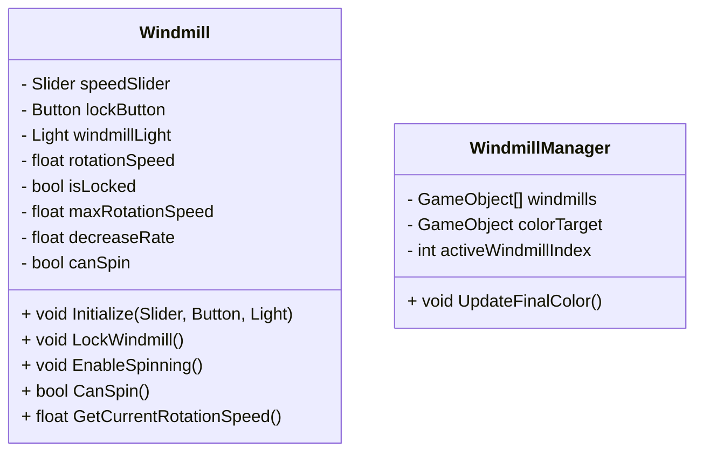

https://github.com/user-attachments/assets/84264dfa-fa3d-473b-9cec-4805bc48045a

```mermaid
classDiagram
    class Windmill {
        - Slider speedSlider
        - Button lockButton
        - Light windmillLight
        - float rotationSpeed
        - bool isLocked
        - float maxRotationSpeed
        - float decreaseRate
        - bool canSpin
        
        + void Initialize(Slider, Button, Light)
        + void LockWindmill()
        + void EnableSpinning()
        + bool CanSpin()
        + float GetCurrentRotationSpeed()
    }

    class WindmillManager {
        - GameObject[] windmills
        - GameObject colorTarget
        - int activeWindmillIndex
        
        + void UpdateFinalColor()
    }
```
